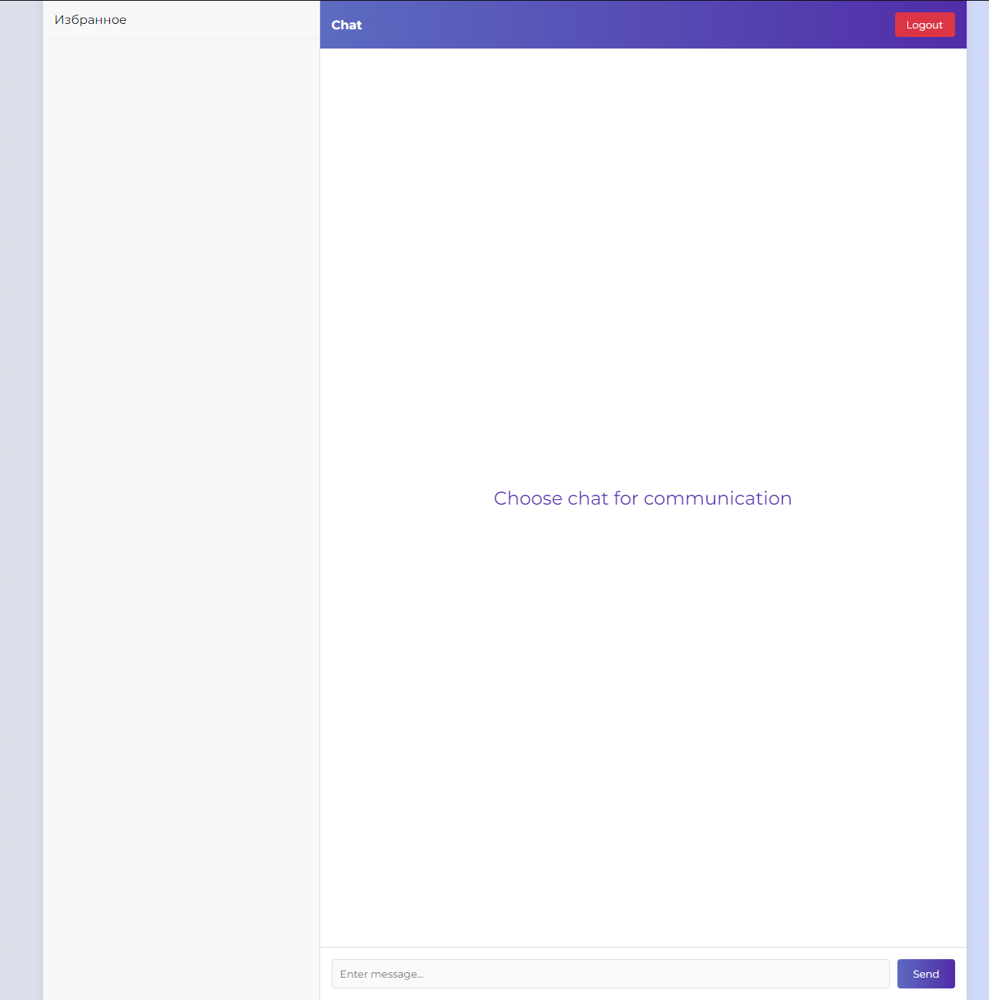

# Simple Chat App
Simple Chat App written in Python





# How to run
---
Clone this repo
```bash
git clone https://github.com/FranChesK0/simple-chat-app.git
```

Run docker compose
```bash
docker-compose up -d
```
